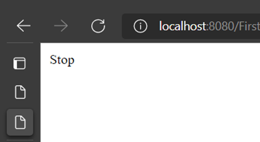

# ControlPanel DB Linkage
The database and the interface linkage for dynamic functionality

# Usage
Step1 the HTML code creates the interface using CSS styling 

Step2 creating JSP pages to add navigation function to the buttons

Step3 sending the Control Panel values through the JSP pages to the databse using queries

Step4 retrieve the last stored values from the database and display it to the user

# Control Panel Interface

After pressing the desired direction for the robot, you will be navigated to the responsive JSP page to notify you with the progress of your request.
For example pressing the up arrow will retrieve and print the "Forward" string value from the DB as shown in the picture below, and the stop button will retrieve and print the "Stop" value, likewise other arrows.

